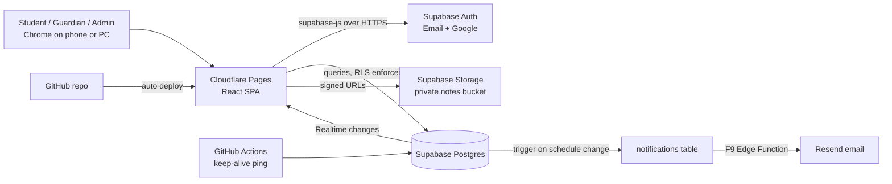
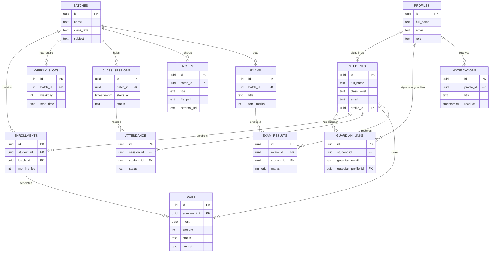
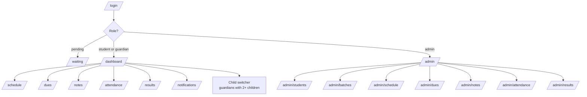

# PROJECT_PLAN.md
Project: Tuition Portal
Date: 2026-09-19
Type: Personal / portfolio

## 1. Summary
A private portal for my tuition students and their guardians. Students and guardians sign up with email or Google, and once linked by me they can see the class schedule (with live notice of cancellations and extra classes), monthly dues and payment status, attendance, exam results, and download notes for their own batch. The MVP goal is a deployed site that my two current students and their guardians can actually use, built so it scales to more batches without redesign.

## 2. Stack decision and justification

**Classification:** dynamic app, auth required, relational data, private file storage, light realtime (schedule change alerts), no CMS beyond my own admin screens, no e-commerce, SEO irrelevant (everything is behind login), tiny scale, free tier only.

- **Frontend: React + Vite + TypeScript + Tailwind CSS (SPA).**
  Why: every page is gated behind login, so server rendering and SEO bring no benefit. A static SPA deploys anywhere for free, and React has the richest set of ready components for calendars, file uploads, and tables. TypeScript catches mistakes in the many role-dependent screens. Supporting libraries: React Router (routes), TanStack Query (caching and refetching Supabase data), react-hook-form + zod (forms and validation), date-fns (dates).
  Rejected: Next.js (server rendering and API routes duplicate what Supabase already provides), Astro (content-first, weak fit for an interactive dashboard), SvelteKit (good fit technically, but smaller ecosystem for calendar and table components).

- **Backend / BaaS: Supabase.**
  Why: one free service gives Postgres, email and Google auth, file storage, realtime subscriptions, scheduled jobs, and Edge Functions. No server of my own to host, patch, or wake from sleep.
  Rejected: Firebase (Firestore makes "guardian sees only linked children" and "student sees only own batch notes" clumsy to model and secure), Django or Express on Render (free web services sleep after idle and free Postgres expires, both bad for a site parents open at random times), PocketBase (needs an always-on host).

- **Database: Supabase Postgres.**
  Why: the data is naturally relational (students belong to batches, guardians link to students, dues and attendance belong to students). Joins, foreign keys, and aggregate queries for weekly and monthly attendance are easy in SQL.

- **Auth: Supabase Auth with email (magic link or password) and Google.**
  Why: built in, free, handles sessions and password resets. Access control lives in the database through Row Level Security (RLS), so even a tampered frontend cannot read another student's data.
  Linking rule: I create a student or guardian record with their email. When someone signs up with that email, a database trigger links the account and assigns the role. Anyone else stays "pending" and sees only a waiting screen.

- **File storage: Supabase Storage (private bucket) plus optional external links.**
  Why: a private bucket with policies per batch folder means only enrolled students can download. Downloads use short-lived signed URLs.
  Limit to plan around: the free tier caps total storage (around 1 GB) and single uploads (around 50 MB). For very large files (long recordings, big slide decks), a note can hold a Google Drive link instead of an upload. Verify current limits on the Supabase pricing page.

- **Notifications: in-app first, email later.**
  In-app: a trigger inserts a row into `notifications` whenever a session is cancelled, moved, or added; the bell icon updates live through Supabase Realtime. Email (F9): a Supabase Edge Function sends through Resend's free tier. Web push was rejected for now because it adds service worker and permission complexity for two students.

- **Hosting: Cloudflare Pages (frontend).**
  Why: unmetered static bandwidth, auto deploy from GitHub, and no commercial-use restriction (this site supports paid tutoring). Rejected: Vercel Hobby (bans commercial use), GitHub Pages (workable, but no preview deploys per branch).
  **Free-tier gotcha that matters here:** Supabase pauses free projects after about 7 days without activity. With only two students, a quiet week is realistic. Fix in F1: a GitHub Actions workflow that makes one small database request every few days. Also export a database backup monthly, since free projects have no point-in-time recovery. Verify both behaviours on the Supabase docs.

## 3. Architecture diagram



## 4. Data model

| Table | Key fields | Notes |
|---|---|---|
| profiles | id (= auth user id), full_name, email, role (admin, student, guardian, pending), created_at | One row per signed-up account |
| batches | id, name, class_level, subject, active | A class or group I teach |
| students | id, full_name, class_level, email, phone, profile_id (nullable), joined_on, active | Created by me; profile_id fills in when the student signs up |
| enrollments | id, student_id, batch_id, monthly_fee, start_month, active | Lets one student join more than one batch |
| guardian_links | id, student_id, guardian_email, guardian_profile_id (nullable), relation | Filled by me; profile links on guardian signup |
| weekly_slots | id, batch_id, weekday, start_time, end_time | The normal weekly routine |
| class_sessions | id, batch_id, starts_at, ends_at, status (scheduled, cancelled, rescheduled, extra), note, updated_at | Actual dated classes, generated from slots or added by hand |
| attendance | id, session_id, student_id, status (present, absent, late), note | Weekly and monthly views are SQL aggregates |
| dues | id, student_id, enrollment_id, month, amount, status (due, paid, waived), paid_on, method, txn_ref, note | One row per student per batch per month |
| notes | id, batch_id, title, description, file_path (nullable), external_url (nullable), file_type, size_bytes, uploaded_at | Either an uploaded file or a link |
| exams | id, batch_id, title, exam_date, total_marks | |
| exam_results | id, exam_id, student_id, marks, remarks | |
| notifications | id, profile_id, title, body, link, read_at, created_at | Feeds the bell icon and later emails |

**Access rules (RLS summary)**
- Admin: full read and write on everything.
- Student: reads own student row, own enrollments, sessions and notes of own batches, own attendance, dues, results, notifications.
- Guardian: same read access as their linked students, across all linked children.
- Pending: reads only their own profile.
- Helper SQL functions: `is_admin()`, `my_student_ids()` (own id for students, linked children for guardians), `my_batch_ids()`.

## 5. ER diagram



## 6. Site map



## 7. Folder structure

```
tuition-portal/
  docs/
    PROJECT_PLAN.md
  public/
    _redirects              (/* /index.html 200, so SPA routes work on Cloudflare Pages)
  src/
    main.tsx
    app/
      router.tsx
      providers.tsx
      RequireRole.tsx
    lib/
      supabase.ts
      types.ts              (generated from the database schema)
      format.ts
    components/
      ui/                   (Button, Card, Badge, Modal, EmptyState)
      layout/               (AppShell, BottomNav, Sidebar, NotificationBell)
    features/
      auth/
      schedule/
      dues/
      notes/
      attendance/
      results/
      notifications/
      admin/
    styles/
      index.css
  supabase/
    migrations/             (one SQL file per feature, schema plus RLS)
    functions/              (Edge Functions, F9)
    seed.sql
  .github/
    workflows/
      keepalive.yml
  .env.example              (VITE_SUPABASE_URL, VITE_SUPABASE_ANON_KEY)
  index.html
  package.json
  tsconfig.json
  vite.config.ts
  README.md
```

## 8. Build tools
- Editor: VS Code (Windows)
- Test browser: Chrome (plus Chrome device toolbar for phone layout)
- Package manager: npm
- Framework CLI: `npm create vite@latest` (React + TypeScript template), Supabase CLI for migrations and type generation
- Deploy: Cloudflare Pages connected to GitHub for auto deploy on push to main
- Version control: Git and GitHub, synced to the Claude Project
- Useful extras: Supabase dashboard SQL editor for quick checks; two test accounts (one student, one guardian) for checking RLS

## 9. Feature roadmap

- [ ] **F1: Skeleton, auth, deploy.** Vite app, Tailwind, Supabase project, `profiles` and `students` tables with RLS, email and Google login, signup trigger that links by email and sets role, pending screen, role-based redirect, keep-alive workflow, live on Cloudflare Pages. Test: I add a student by email, that person signs up and lands on a dashboard showing their name; an unknown email lands on the waiting page.
- [ ] **F2: Batches, enrollments, guardians.** Admin screens to create batches, enroll students with a monthly fee, and add guardian emails. Guardian signup links automatically; child switcher for guardians. Depends on F1.
- [ ] **F3: Schedule.** Weekly slots per batch, "generate sessions for next 4 weeks" button, cancel, reschedule, or add an extra class with a note. Student and guardian see an upcoming list and a week view with clear status colours. Depends on F2.
- [ ] **F4: In-app notifications.** Database trigger on `class_sessions` changes inserts a notification for every student and guardian of that batch. Bell with unread count updates live through Realtime. Depends on F3.
- [ ] **F5: Dues.** "Generate dues for month" button creates rows for active enrollments; admin marks paid with date, method (bKash, cash), and transaction ID. Students and guardians see due, paid, and history with totals. Depends on F2.
- [ ] **F6: Notes.** Admin uploads a file to the private bucket under the batch folder, or saves an external link for large files. Students see only their batch notes and download through signed URLs. Show file type and size. Depends on F2.
- [ ] **F7: Attendance.** Mark present, absent, or late per session from the admin schedule screen. Weekly and monthly summaries (count and percentage) for students and guardians. Depends on F3.
- [ ] **F8: Exam results.** Admin creates exams per batch and enters marks; students and guardians see a results list and simple progress chart. Depends on F2.
- [ ] **F9: Email notifications.** Edge Function with Resend sends email for schedule changes and a monthly dues reminder (scheduled with pg_cron). Opt-out toggle per user. Depends on F4 and F5.
- [ ] **F10: Polish.** Installable PWA (home screen icon), loading and empty states, Bangla-friendly fonts checked, monthly backup routine, README with screenshots for the portfolio.

Order note: F5 and F6 only need F2, so they can be built before F3 and F4 if dues or notes are more urgent.

## 10. Decisions log
- 2026-09-19: React + Vite SPA because all pages are behind login, so SEO and server rendering add nothing. Rejected Next.js (duplicate backend layer) and SvelteKit (smaller component ecosystem).
- 2026-09-19: Supabase for auth, database, storage, and realtime in one free service. Rejected Firebase (awkward per-batch and guardian access rules), Django or Express on Render (free services sleep, free Postgres expires), PocketBase (needs always-on host).
- 2026-09-19: Cloudflare Pages for hosting because of unmetered bandwidth and no commercial-use ban. Rejected Vercel Hobby.
- 2026-09-19: Manual bKash payments. Dues are tracked and marked paid by me with a transaction ID. Rejected a payment gateway (merchant account and fees are overkill for this scale).
- 2026-09-19: Self signup with email-based linking. Unknown accounts stay pending, so open signup never exposes data.
- 2026-09-19: Notes allow external links as well as uploads, to stay within free storage and upload size limits.
- 2026-09-19: In-app notifications first, email in F9, web push deferred.
- 2026-09-19: Kept fully separate from the Flutter tuition tracker, as requested.

## 11. Open questions
- Should guardians see notes, or only schedule, dues, attendance, and results? (Plan currently gives guardians the same read access as the student.)
- Is the fee set per student or per batch? (Plan stores it per enrollment, which covers both.)
- Should students see their own attendance percentage, or only guardians?
- Any need for a Bangla interface, or English UI with Bangla content only?
